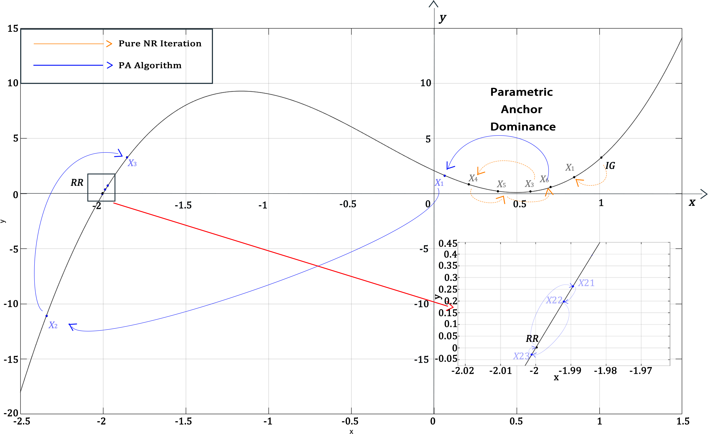
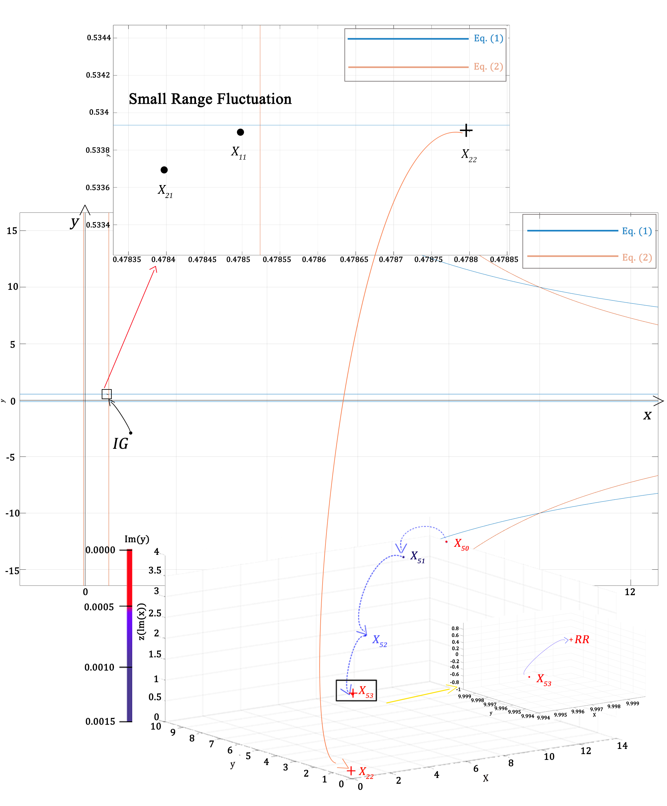
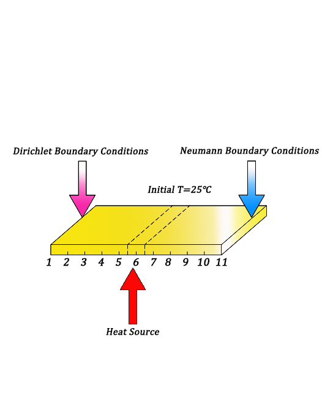
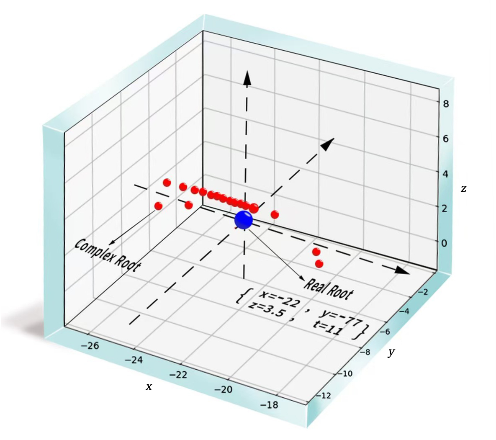

# ✨Parametrix✨


This repository implements an enhanced version of the Newton-Raphson Method (NRM) named Parametrix aimed at overcoming common convergence issues in nonlinear systems. 

<div align="center">
  
  <p><i>Figure 1: Simple PA algorithm Implementation</i></p>
</div>

Traditional NRM can struggle with convergence when facing certain challenges, such as:

1. Presence of local extrema.
2. Poorly conditioned systems (e.g., parallel or nearly parallel planes).
3. Nearly intersecting planes that don’t actually meet.
4. Coincidence of the root with the first derivative.

To address these issues, this algorithm integrates two key strategies:

**Parametric Anchor (PA):** A large-magnitude anchor is embedded to make the linearized matrix diagonally dominant, facilitating better convergence. As iterations progress, PA is gradually diminished to refine the solution.
**Complex Numbers as Initial Guesses:** In cases of divergence, complex numbers are used as initial guesses, allowing the algorithm to explore smoother, alternative convergence paths and avoid zero Jacobian matrices.
These strategies have been tested on various nonlinear systems relevant to engineering and physics, including:

1. Arrhenius chemical reactions

<div align="center">
  
  <p><i>Figure 2: Iterative Procedure for Solving Arrhenius Chemical Reaction Nonlinear System</i></p>
</div>

2. Transient heat conduction with temperature-dependent conductivities

<div align="center">
  
  <p><i>Figure 3: Simple Copper Plate Heat Conduction Example</i></p>
</div>

3. Adversarial dynamics in Generative Adversarial Networks (GANs)

<div align="center">
  
  <p><i>Figure 4: RR Cluster with Surrounding CRs in GAN Dynamics System</i></p>
</div>

The proposed approach significantly enhances the robustness of NRM, making it a valuable tool for researchers and engineers dealing with complex nonlinear systems.


## Installation

### Requirements

- **MATLAB**: This project requires any version of MATLAB. Ensure that MATLAB is properly installed on your system.
- **Basic Newton-Raphson Functionality**: The project is designed to extend the Newton-Raphson method. No additional toolboxes or packages are required beyond MATLAB's built-in functionality.

### Setup

1. **Clone the Repository**: Download or clone this repository to your local machine.
   ```bash
   git clone https://github.com/Aveiro-Lin/Parametrix.git
   ```

2. **Open MATLAB**: Start MATLAB and navigate to the folder where you cloned the repository.

3. **Run the Code**: Follow the instructions in the Usage section to start using the enhanced Newton-Raphson algorithm. The code is designed to run directly in MATLAB with no additional dependencies.


## Notes

- This project does not require any additional MATLAB toolboxes.
- Compatible with all versions of MATLAB, as long as the basic Newton-Raphson algorithm can be implemented.


## License

Our research code is released under the MIT license. See [LICENSE](LICENSE) for details. 


## Acknowledgments

Our implementation and experiments are built on top of open-source GitHub repositories. We thank all the authors who made their code public, which tremendously accelerates our project progress. If you are interested in implementing the Newton-Raphson Method (NRM) in other programming languages, you may consider citing the following code repositories as references and innovating upon them.

[scijs/newton-raphson-method](https://github.com/scijs/newton-raphson-method)

[RayDeCampo/java-xirr](https://github.com/RayDeCampo/java-xirr)

[Toktom/Newton-Raphson-Method](https://github.com/Toktom/Newton-Raphson-Method)

